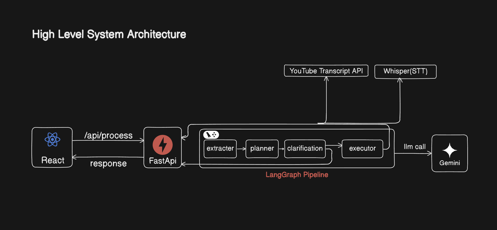
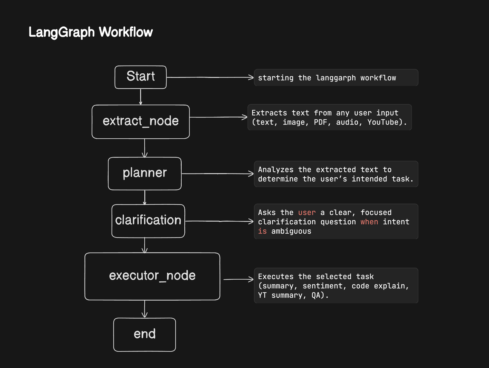
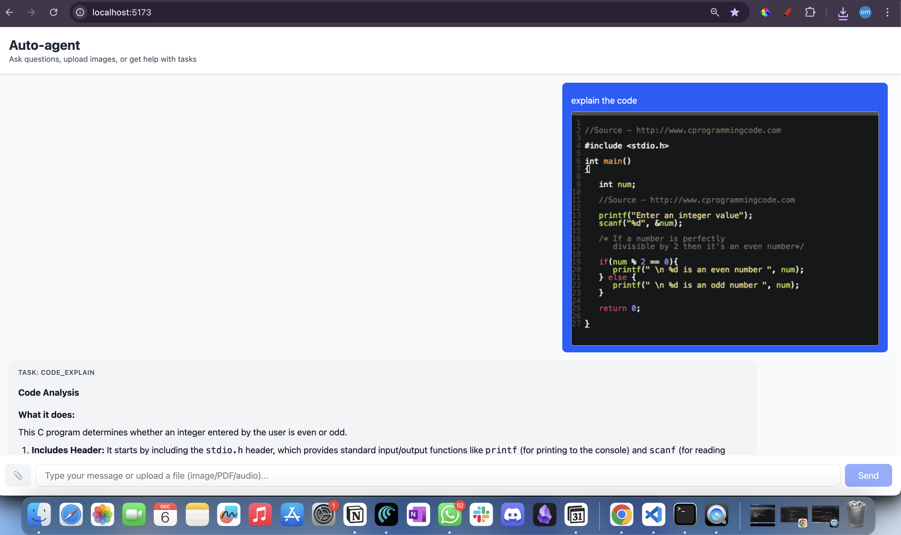

# Agent
The agent can understand and process **text, images, PDFs, audio, and YouTube links**, ask clarification questions when needed, and execute tasks with structured, explainable outputs.

## What This Agent Can Do

### Understand Multimodal Inputs

* Text
* Image screenshots (OCR via Gemini Vision)
* PDF files (digital + scanned OCR fallback)
* Audio (Whisper STT)
* YouTube links (transcript extraction)


## High Level Architecture


## LangGraph Workflow



## Demo Video
Click the image below to watch the full demo 

[](https://youtu.be/kEtsiuWTCVM)


## Tech Stack

* **FastAPI** (backend API)
* **LangGraph** (agent orchestration)
* **Gemini 2.5 Flash** (LLM + Vision)
* **Gemini OCR** (for images + scanned PDFs)
* **pdfplumber + pdf2image** (fallback extraction)
* **Whisper** (audio transcription)
* **React** (frontend)

---

## Running Locally

### Install dependencies

```bash
pip install -r requirements.txt
```

### Start backend

```bash
uvicorn main:app --reload
```

### Start frontend

```bash
npm install
npm run dev
```